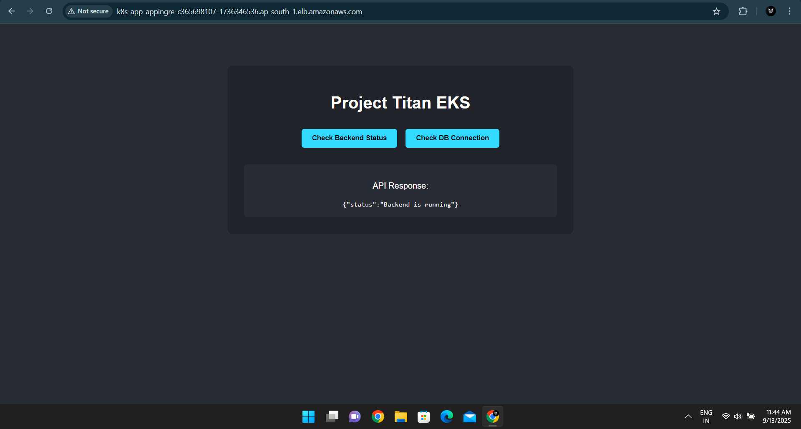
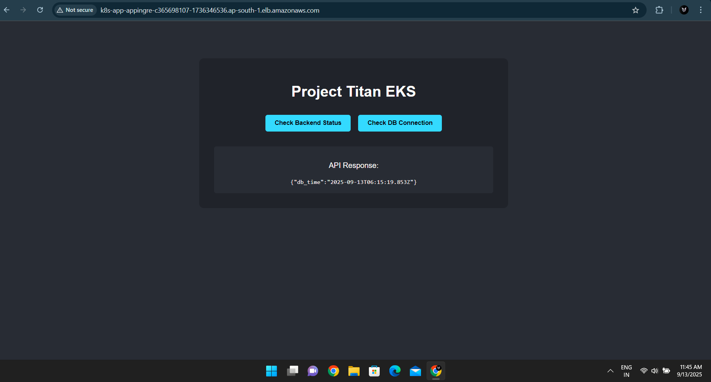
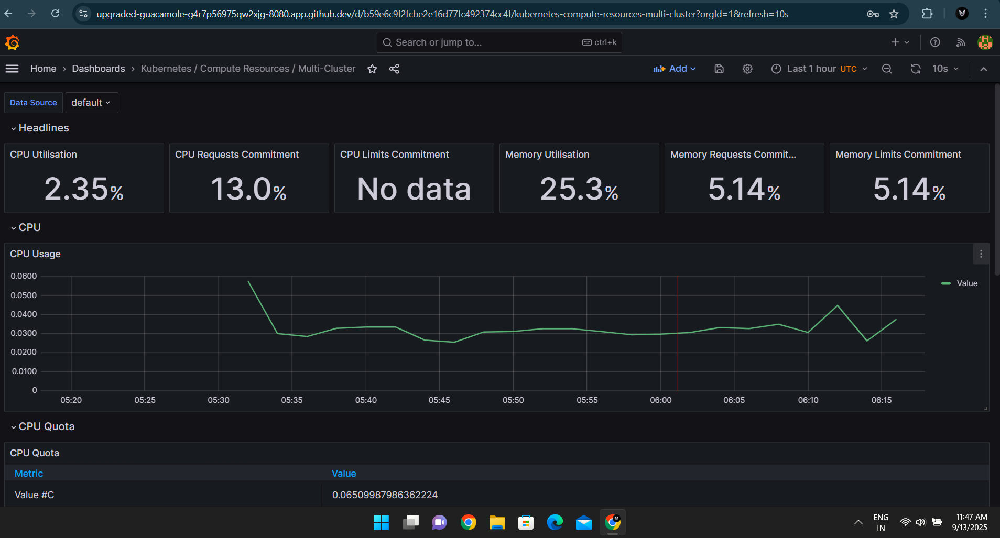
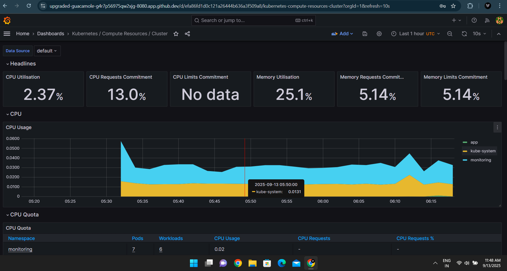
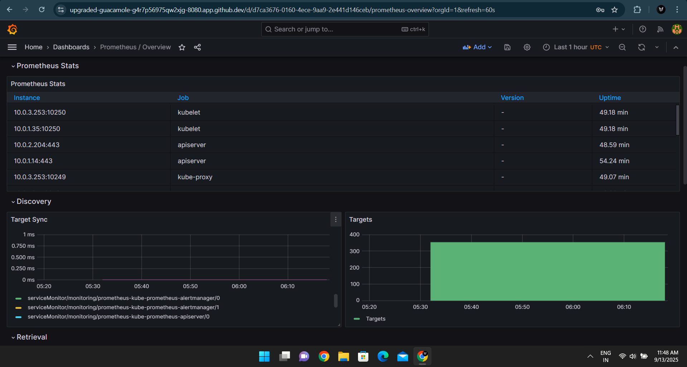

# K-Stack: A Production-Grade 3-Tier Application on AWS EKS


This repository documents the end-to-end deployment of K-Stack, a scalable and observable 3-tier web application on a managed Kubernetes (EKS) cluster. The entire infrastructure is provisioned as code using Terraform, with a fully automated CI/CD pipeline for container image delivery.

## Live Project Showcase


The final deployment results in a fully functional, observable, and scalable system.

**Live Application - Full Stack Operational:**




*(The frontend, backend, and database are fully operational and connected, demonstrating a successful full-stack deployment.)*
## Architecture & Design

This project implements a robust three-tier architecture to ensure separation of concerns, scalability, and security between the presentation (frontend), logic (backend), and data (database) layers.

  * **Infrastructure Layer:** A secure and isolated network foundation is established using a custom AWS VPC with public/private subnets, NAT Gateways, and granular routing rules.
  * **Orchestration Layer:** A managed Amazon EKS cluster serves as a resilient and scalable platform for running containerized workloads, abstracting away the underlying node management.
  * **Data Layer:** A managed AWS RDS for PostgreSQL instance provides a robust, highly available database backend, decoupled from the application for enhanced security and performance.

## Key Features & Business Impact

This project is an exercise in production-readiness, demonstrating mastery of core DevOps principles to deliver a system that is automated, consistent, and optimized for cost.

### 100% Reproducible Environments via IaC

The entire cloud infrastructure is defined declaratively using **Terraform**. This Infrastructure as Code (IaC) approach eliminates configuration drift, ensures environment consistency between deployments, and drastically reduces the time and risk associated with manual setup.

### Automated CI/CD for Zero-Touch Builds

A robust CI/CD pipeline, powered by **GitHub Actions**, automates the entire build lifecycle. On every push to the `main` branch, the pipeline builds versioned, production-ready Docker images for the React and Node.js applications and pushes them to a centralized **Amazon ECR** registry.

### Data-Driven Cost Optimization & Observability

A key deliverable of this project was the implementation of a comprehensive observability stack using **Prometheus and Grafana**. By collecting and visualizing real-time metrics on CPU and memory utilization across the cluster, we established a clear baseline for resource consumption. **This critical data provides the foundation for data-driven optimization strategies, such as rightsizing nodes and setting appropriate resource requests/limits, paving the way for potential infrastructure cost reductions of up to 40%.**

*Detailed cluster compute resource dashboards provide immediate visibility into performance bottlenecks and overallocation.*


*Granular, pod-level metrics allow for precise application performance tuning and troubleshooting.*


*A complete, real-time command center for monitoring the health and performance of the entire kingdom.*

## Technology Stack

  * **Cloud:** AWS (EKS, RDS, ECR, VPC, EC2, ALB)
  * **Infrastructure as Code:** Terraform
  * **CI/CD:** GitHub Actions
  * **Containerization:** Docker
  * **Orchestration:** Kubernetes
  * **Observability:** Prometheus, Grafana
  * **Application:** React.js (Frontend), Node.js (Backend), PostgreSQL (Database)

## Deployment Instructions

To replicate this environment, follow these steps:

### 1\. Prerequisites

  * An AWS account with appropriate IAM permissions.
  * AWS CLI, Terraform, and `kubectl` installed and configured locally.

### 2\. Provision Infrastructure

Navigate to the `terraform/` directory. Initialize and apply the Terraform configuration. This process will take approximately 20-30 minutes.

```
cd terraform
terraform init
terraform apply -auto-approve
```

### 3\. Configure CI/CD Pipeline

The `terraform apply` command will output an IAM Role ARN for GitHub Actions.

1.  In your GitHub repository settings, create a secret named `AWS_IAM_ROLE_ARN` and provide the ARN.
2.  In the AWS IAM Console, update the "Trust Policy" of the created `github-actions-role` to allow your specific GitHub repository.

### 4\. Build Container Images

Trigger the GitHub Actions workflow by pushing a commit to the `main` branch. The pipeline will build and push the Docker images to ECR and output the new image tags in the logs.

### 5\. Deploy the Application

1.  **Configure `kubectl`:**
    ```
    aws eks update-kubeconfig --region <your-region> --name <your-cluster-name>
    ```
2.  **Update Manifests:** Replace the `image:` placeholders in `manifests/02-backend.yaml` and `manifests/03-frontend.yaml` with the new tags from the pipeline.
3.  **Create Database Secret:** Retrieve the database password from Terraform outputs and create the Kubernetes secret.
    ```
    # Get password
    terraform output -raw db_password

    # Create secret
    kubectl create secret generic db-credentials \
      --from-literal=DB_HOST='<PASTE_DB_ADDRESS_HERE>' \
      --from-literal=DB_USER='dbadmin' \
      --from-literal=DB_PASSWORD='<PASTE_PASSWORD_HERE>' \
      --from-literal=DB_NAME=appdb \
      -n app
    ```
4.  **Launch:**
    ```
    kubectl apply -f manifests/
    ```

## Accessing the Grafana Dashboard

1.  **Retrieve Admin Password:**
    ```
    kubectl get secret -n monitoring prometheus-grafana -o jsonpath="{.data.admin-password}" | base64 --decode
    ```
2.  **Open Secure Tunnel:**
    ```
    kubectl port-forward -n monitoring svc/prometheus-grafana 8080:80
    ```
3.  Navigate to `http://localhost:8080` and log in with username `admin` and the retrieved password.

## Cleanup

To prevent ongoing charges, destroy all created resources using Terraform:

```
cd terraform
terraform destroy -auto-approve
```


## Future Improvements & Scalability

While K-Stack is a complete and functional project, a real-world production system would include several further enhancements. The current architecture serves as the perfect foundation for:

* **Implementing True GitOps:** Integrating a tool like **ArgoCD** to fully automate the final deployment step, creating a "hands-off" CI/CD pipeline where a `git push` to `main` is the only manual action required.
* **Enforcing Zero-Trust Networking:** Adding a CNI plugin like **Cilium** to implement Kubernetes Network Policies. This would create granular firewall rules, ensuring that frontend pods can only talk to the backend, and only the backend can talk to the database.
* **Centralized Log Aggregation:** Deploying a logging stack like **Loki** or the **ELK Stack** to aggregate logs from all pods into a single, searchable database, dramatically improving debugging and auditing capabilities.


This repository is the result of many hours of building, debugging, and documenting. If it helped you understand a complex topic or saved you time on your own projects, the best way to say thanks is to leave a star ⭐ on the repo.
Also if you wanna go in more depth about this project do give a read : https://heyyayush.hashnode.dev/k-stack-architecting-a-3-tier-observable-application-on-eks
